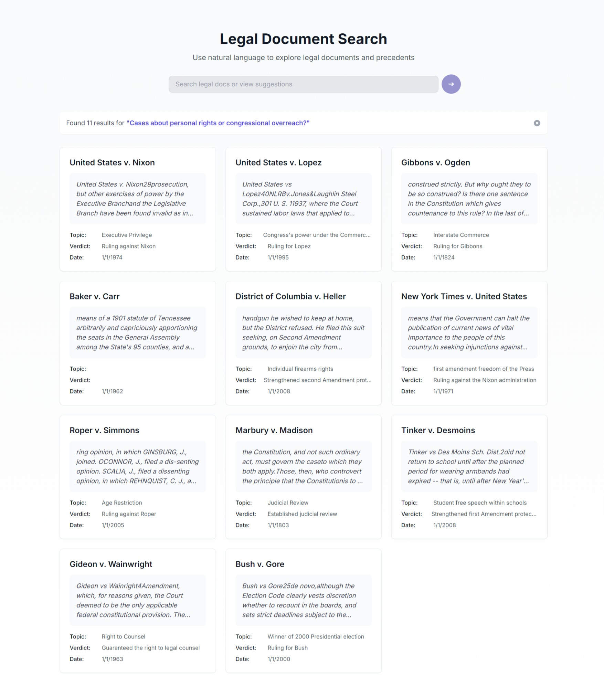

# 📚 CaseCompass AI

Welcome to **CaseCompass AI** — a cutting-edge legal semantic search application designed to revolutionize the way legal professionals and students retrieve and analyze legal documents. Leveraging advanced technologies like **Next.js**, **LangChain**, **Pinecone**, and **Voyage AI**, CaseCompass AI provides an efficient and intuitive platform for legal research.

## 🚀 Project Overview

CaseCompass AI is a web application that indexes legal documents and enables semantic search capabilities powered by vector embeddings. By utilizing state-of-the-art machine learning models and vector databases, the app facilitates easy and efficient retrieval of legal information, significantly enhancing the research workflow for lawyers and law students.

## ✨ Features

- **Semantic Search**: Leverages AI-driven embeddings to understand the context of queries and retrieve the most relevant legal documents.
- **Document Indexing**: Efficiently indexes large volumes of legal texts for quick access and retrieval.
- **User-Friendly Interface**: Built with Next.js and Tailwind CSS for a responsive and intuitive user experience.
- **Scalable Architecture**: Designed with scalability in mind to handle extensive legal databases.

## 🛠️ Tech Stack

- **Next.js (v14.2.3)**: A React framework for building high-performance web applications with server-side rendering and static site generation.
- **LangChain**: A library for building language model applications, used here for document loading, splitting, and processing.
- **Pinecone**: A vector database optimized for storing and querying vector embeddings at scale.
- **Voyage AI**: Provides domain-specific embeddings models optimized for legal text.
- **TypeScript**: Enhances code quality and developer productivity with static type checking.
- **Tailwind CSS**: A utility-first CSS framework for rapid UI development.

## 🧠 Methodology

### Semantic Search with Vector Embeddings

Traditional keyword-based search systems often fail to capture the nuanced meanings within legal texts. CaseCompass AI overcomes this limitation by implementing semantic search using vector embeddings:

1. **Document Ingestion**: Legal documents are loaded using LangChain's `DirectoryLoader` and `PDFLoader`.
2. **Text Splitting**: Documents are split into manageable chunks with `RecursiveCharacterTextSplitter` to optimize embedding generation.
3. **Vector Embedding Generation**: Each text chunk is transformed into a high-dimensional vector using Voyage AI's `voyage-law-2` model, specialized for legal content.
4. **Indexing**: The embeddings are stored in Pinecone's vector database, allowing for efficient similarity searches.
5. **Query Processing**: User queries are also converted into embeddings, and Pinecone retrieves the most contextually similar documents.

### Best Practices and Design Patterns

- **Modular Architecture**: The codebase is organized for maintainability, with clear separation of concerns between data ingestion, processing, and API services.
- **Asynchronous Operations**: Utilizes async/await patterns for non-blocking I/O and improved performance during batch processing and API calls.
- **Error Handling and Logging**: Comprehensive error handling ensures robustness, while detailed logging aids in debugging and monitoring.
- **Scalability**: Designed to handle large datasets and scale horizontally by leveraging serverless technologies and cloud services.

## 🌟 Novelty Compared to Traditional Approaches

- **Domain-Specific Embeddings**: By using Voyage AI's legal embeddings model, the application achieves superior understanding of legal terminology and nuances compared to generic language models.
- **Efficient Vector Search**: Pinecone's optimized vector database allows for real-time retrieval of relevant documents, outperforming traditional relational databases in semantic search tasks.
- **Automated Bootstrapping**: The app includes an automated process to initialize and populate the vector index, streamlining deployment and scalability.

## 📂 Project Structure

- `/src`
  - `/app`
    - `api/` - API routes for search functionality.
    - `services/` - Services for handling bootstrapping and interaction with Pinecone.
    - `page.tsx` - Main entry point for the application.
  - `/components` - Reusable UI components.
  - `/lib` - Utility functions and helpers.
- `/docs` - Directory containing legal documents and metadata (`db.json`).
- `/public` - Static assets.
- `bootstrap.ts` - Script for initializing the vector database with embeddings.

## 🔍 Detailed Technical Implementation

### Bootstrapping Process (`bootstrap.ts`)

The bootstrapping script performs the following steps:

1. **Index Initialization**: Checks if the specified Pinecone index exists and creates it if necessary using `createIndexIfNecessary()`.
2. **Document Loading**: Loads PDFs from the `/docs` directory using LangChain's `DirectoryLoader` and `PDFLoader`.
3. **Metadata Enrichment**: Reads metadata from `db.json` and merges it with the document data.
4. **Content Validation**: Filters out invalid or empty content to ensure high-quality data.
5. **Text Splitting**: Splits documents into chunks using `RecursiveCharacterTextSplitter` for optimal embedding performance.
6. **Embedding Generation**: Generates embeddings for document chunks using Voyage AI's embeddings model.
7. **Batch Upserts**: Inserts embeddings into Pinecone in batches for efficiency and rate limiting management.

### Search Functionality

- **Query Embedding**: User queries are embedded using the same Voyage AI model to ensure consistent vector space representation.
- **Similarity Search**: Pinecone performs a similarity search to find documents whose embeddings are closest to the query embedding.
- **Result Presentation**: The application presents the retrieved documents in a user-friendly manner, highlighting their relevance.

## 🛡️ Security and Best Practices

- **Environment Variables**: API keys and sensitive information are stored securely using environment variables.
- **Input Validation**: User inputs are validated to prevent injection attacks and ensure system integrity.
- **Error Handling**: Graceful error handling prevents application crashes and provides informative feedback to users.

## 🎨 UI/UX Design

- **Responsive Design**: The application is optimized for various screen sizes, ensuring accessibility on different devices.
- **Intuitive Navigation**: A clean and minimalist interface allows users to focus on their search tasks without distractions.
- **Feedback Mechanisms**: Loading indicators and status messages keep users informed about the application's state.

## 📈 Performance Optimization

- **Batch Processing**: Embedding generation and database upserts are performed in batches to optimize throughput.
- **Asynchronous I/O**: Non-blocking I/O operations enhance performance during data loading and network requests.
- **Caching Strategies**: Potential to implement caching mechanisms to further reduce latency for frequent queries.

## 📝 Future Enhancements

- **Scalability Improvements**: Implement horizontal scaling strategies to handle increasing data volumes and user load.
- **Additional Data Sources**: Expand the document corpus by integrating with external legal databases and APIs.
- **Advanced Query Handling**: Incorporate natural language understanding to handle more complex queries and legal reasoning.
- **User Authentication**: Add authentication mechanisms to provide personalized experiences and secure access control.

## 🤝 Contributing

Contributions are welcome! Please open issues and pull requests to help improve CaseCompass AI.

## 📄 License

This project is licensed under the MIT License - see the LICENSE file for details.

## 📧 Contact

For inquiries or support, please contact [Satadru Bhowmik](fcb.satadrud10s@gmail.com).

---

*Empowering legal professionals with AI-driven insights for a smarter future.*

---

# 📷 Screenshots

*The intuitive home page welcoming users to a powerful legal search experience.*

*Semantic search results displaying the most relevant legal documents.*

---

## 🌐 Links

- **Project Repository**: [GitHub](https://github.com/yourusername/CaseCompassAI)
- **Live Demo**: [CaseCompass AI Demo](https://casecompassai.example.com)

---

## 🏷️ Keywords

`Next.js`, `LangChain`, `Pinecone`, `Voyage AI`, `Semantic Search`, `Legal Tech`, `Vector Embeddings`, `Machine Learning`, `Artificial Intelligence`, `Natural Language Processing`, `TypeScript`, `React`, `Tailwind CSS`

---

## 💡 Acknowledgments

- **Pinecone** for providing an excellent vector database solution.
- **Voyage AI** for their specialized legal embeddings model.
- **LangChain** for simplifying the handling of document processing and embedding workflows.

---

# 👨‍💻 About the Developer

*An innovative software engineer with a passion for leveraging cutting-edge technologies to solve complex problems. Demonstrated expertise in full-stack development, AI integration, and scalable architecture design.*

---

*Feel free to explore the codebase, contribute, or reach out for collaboration opportunities!*
